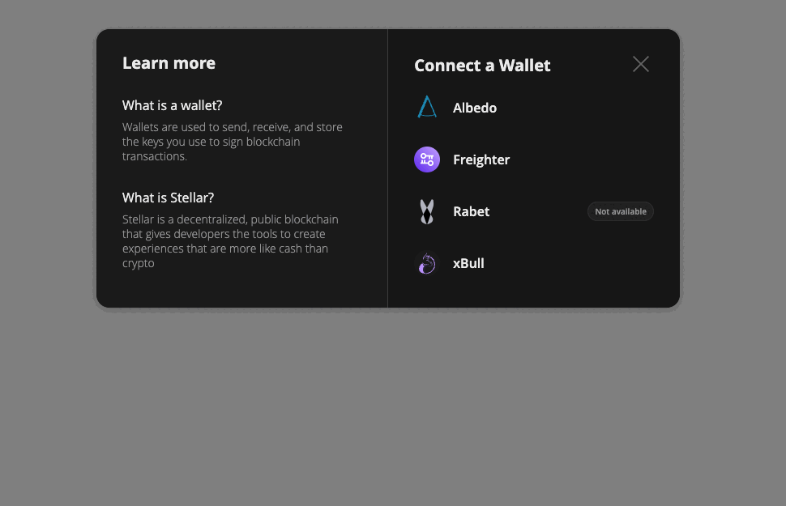
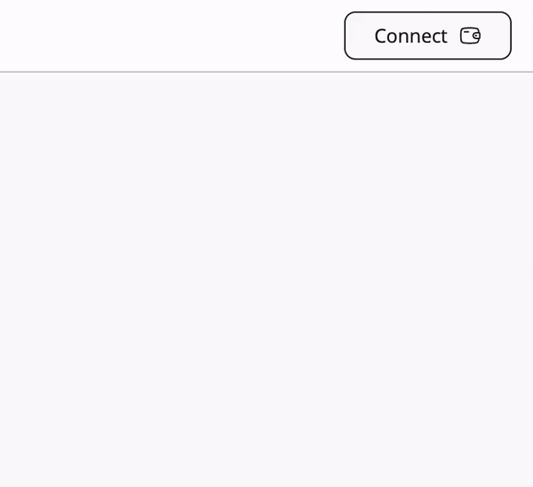

# 🏰 FortWallet Kit

[](https://www.npmjs.com/package/fort-wallet-kit)
[](LICENSE)
[](https://www.typescriptlang.org/)

**FortWallet Kit** is a modern, elegant solution to handle all Stellar Wallets at once with a simple API and premium UI/UX. Built with cutting-edge design principles, it provides a seamless wallet integration experience without caring about individual configurations for each wallet. 

✨ **What makes FortWallet Kit special:**
- **🎨 Premium Design**: Modern gradients, smooth animations, and elegant UI
- **⚡ Smooth Performance**: Optimized animations with cubic-bezier transitions
- **🔮 Modern Effects**: Backdrop blur, shadows, and hover interactions
- **📱 Responsive**: Perfect on mobile and desktop
- **🌙 Dark Mode**: Beautiful light and dark theme support

This library focuses purely on wallet connection and interaction, allowing developers to maintain full control over their UI/UX while providing a beautiful default experience.

## 🚀 Compatible Wallets

- **xBull Wallet** (Both PWA and extension version)
- **Albedo** 
- **Freighter**
- **Rabet** (extension version)
- **WalletConnect**
- **Lobstr**
- **Hana**
- **Hot Wallet**
- **Ledger** (Hardware wallet)
- **Trezor** (Hardware wallet)

## 📦 Installation

```shell
npm install fort-wallet-kit
```

```shell
yarn add fort-wallet-kit
```

```shell
pnpm add fort-wallet-kit
```

## 🏗️ The FortWallet Class

Create a single instance of the FortWallet class to avoid unexpected results:

```typescript
import {
  StellarWalletsKit,
  WalletNetwork,
  allowAllModules,
  XBULL_ID
} from 'fort-wallet-kit';

const kit: StellarWalletsKit = new StellarWalletsKit({
  network: WalletNetwork.TESTNET,
  selectedWalletId: XBULL_ID,
  modules: allowAllModules(),
});
```

> 💡 The `allowAllModules()` function includes all available wallet modules except those requiring custom configuration (like WalletConnect). Check `src/modules` for all available modules.

### 🎯 Specify Supported Wallets

If you want to support only specific wallets:

```typescript
import {
  FreighterModule,
  StellarWalletsKit,
  WalletNetwork,
  XBULL_ID,
  xBullModule
} from 'fort-wallet-kit';

const kit: StellarWalletsKit = new StellarWalletsKit({
  network: WalletNetwork.TESTNET,
  selectedWalletId: XBULL_ID,
  modules: [
    new xBullModule(),
    new FreighterModule(),
  ]
});
```

### 📋 Available Modules

| Wallet | Module Class | Identifier |
|--------|-------------|------------|
| Albedo | `AlbedoModule` | `ALBEDO_ID` |
| Freighter | `FreighterModule` | `FREIGHTER_ID` |
| Hana | `HanaModule` | `HANA_ID` |
| Ledger | `LedgerModule` | `LEDGER_ID` |
| Trezor | `TrezorModule` | `TREZOR_ID` |
| Lobstr | `LobstrModule` | `LOBSTR_ID` |
| Rabet | `RabetModule` | `RABET_ID` |
| WalletConnect | `WalletConnectModule` | `WALLET_CONNECT_ID` |
| xBull | `xBullModule` | `XBULL_ID` |
| HOT Wallet | `HotWalletModule` | `HOTWALLET_ID` |

## 🎨 Integrated UI Modal



Experience the beautiful, modern modal with premium animations and design:

```typescript
await kit.openModal({
  onWalletSelected: async (option: ISupportedWallet) => {
    kit.setWallet(option.id);
    const { address } = await kit.getAddress();
    // Handle wallet connection
  }
});
```

### ⚙️ Modal Configuration

```typescript
await kit.openModal({
  onWalletSelected: (option: ISupportedWallet) => void;
  onClosed?: (err: Error) => void;
  modalTitle?: string;
  notAvailableText?: string;
});
```

## 🔘 Integrated UI Button



A beautiful, interactive button component with hover effects and smooth animations:

```typescript
await kit.createButton({
  container: document.querySelector('#containerDiv'),
  onConnect: ({ address }) => {
    // Handle wallet connection
    console.log('Connected to:', address);
  },
  onDisconnect: () => {
    // Handle wallet disconnection
    console.log('Wallet disconnected');
  }
});
```

### 🎛️ Button Configuration

```typescript
await kit.createButton({
  container: HTMLElement;
  onConnect: (response: { address: string }) => void;
  onDisconnect: () => void;
  horizonUrl?: string;
  buttonText?: string;
});
```

## 🔐 Wallet Operations

### Get Public Key

```typescript
const { address } = await kit.getAddress();
```

### Sign Transactions

```typescript
const { signedTxXdr } = await kit.signTransaction('XDR_HERE', {
  address,
  networkPassphrase: WalletNetwork.PUBLIC
});
```

## 🛠️ Utility Methods

### Change Selected Wallet

```typescript
await kit.setWallet(FREIGHTER_ID);
```

### Update Network

```typescript
await kit.setNetwork(WalletNetwork.PUBLIC);
```

### Get Available Wallets

```typescript
const wallets = kit.getSupportedWallets();
```

## 🎨 Custom Styling

FortWallet Kit supports CSS custom properties for theming:

```css
:root {
  /* Modal styles */
  --modal-bg-color: #ffffff;
  --modal-text-color: #1e293b;
  --modal-border-radius: 1.5rem;
  
  /* Button styles */
  --button-bg-color: linear-gradient(135deg, #3b82f6 0%, #1d4ed8 100%);
  --button-text-color: #ffffff;
  --button-border-radius: 1rem;
}
```

## 🌟 Who's Using FortWallet Kit?

See FortWallet Kit in action:

- [Stellar Laboratory](https://lab.stellar.org/)
- [xBull Swap](https://swap.xbull.app/)
- [Blend Capital](https://mainnet.blend.capital/)
- [FxDAO](https://app.fxdao.io/)
- [Soroban Domains](https://app.sorobandomains.org/)
- [Stellar Cables](https://stellar.cables.finance/)

## 📖 Documentation

For detailed documentation, examples, and advanced usage, visit our [documentation site](https://docs.fortwallet.io).

## 🤝 Contributing

We welcome contributions! Please read our [Contributing Guide](CONTRIBUTING.md) for details on our code of conduct and the process for submitting pull requests.

## 📝 License

Licensed under the MIT License. See [LICENSE](LICENSE) for more information.

---

<div align="center">

**Built with ❤️ by the FortWallet Team**

[Website](https://fortwallet.io) • [Documentation](https://docs.fortwallet.io) • [GitHub](https://github.com/FortWallet/fort-wallet-kit)

</div>